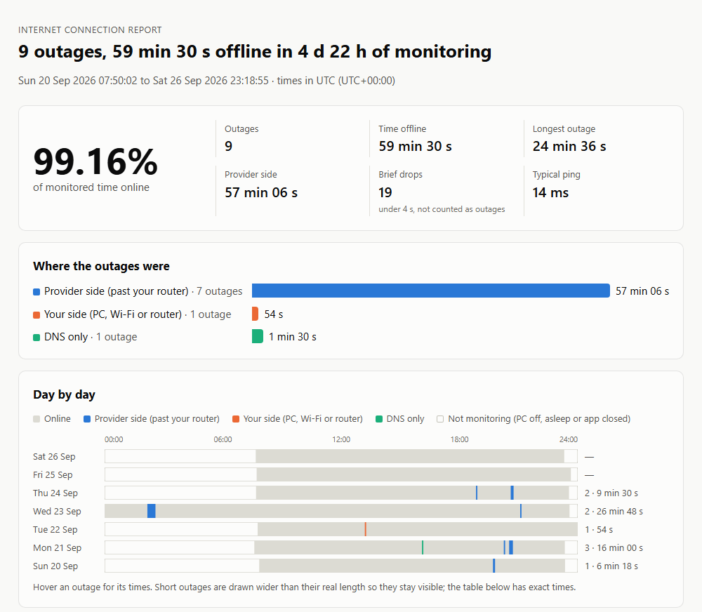
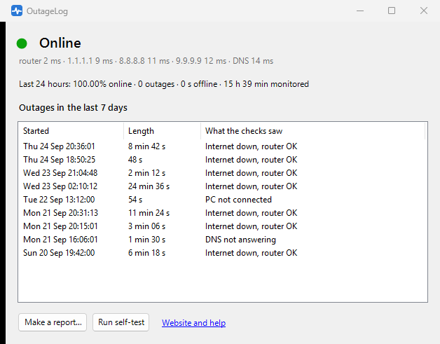

<p align="center"></p>

<h1 align="center">OutageLog</h1>

<p align="center"><b>Log every internet outage on Windows, and get a report that shows whether the problem was on your side or your provider's.</b></p>

<p align="center">
  <a href="https://github.com/BoazCohenJ/OutageLog/releases/latest/download/OutageLog.exe"><b>⬇ Download OutageLog.exe</b></a> ·
  <a href="https://boazcohenj.github.io/OutageLog/">Website</a> ·
  <a href="https://boazcohenj.github.io/OutageLog/sample-report.html">Sample report</a> ·
  <a href="#how-it-decides">How it decides</a> ·
  <a href="#faq">FAQ</a>
</p>

Your internet keeps dropping, but when you call the provider everything "looks fine on our end", and the drop was over before you could run a speed test. What you need is a record of every outage, with times, and something that tells *your* Wi-Fi apart from *their* line.

OutageLog is a small tray app that checks your connection every 2 seconds, logs every drop, and turns the log into a one-page report you can send to your provider: every outage with start time and length, a day-by-day timeline, and a verdict for each one.



## Features

- **Tells the sides apart.** Every round it checks your router *and* three internet servers run by different companies (Cloudflare `1.1.1.1`, Google `8.8.8.8`, Quad9 `9.9.9.9`). Router answers but the internet doesn't: the break is past your router, on the provider's side. Router stops answering too: it's your Wi-Fi, cable or router. Internet answers but names don't resolve: DNS.
- **A report you can send.** One self-contained HTML file with the availability percentage, every outage with times and length, a timeline per day, typical and worst ping, and a CSV download of the outage table. It prints cleanly and opens on any device. [See a sample](https://boazcohenj.github.io/OutageLog/sample-report.html).
- **Honest numbers.** Time the PC was off or asleep isn't counted as uptime or as downtime, reconnecting after wake-up isn't logged as an outage, and single failed checks are counted separately as brief drops rather than inflating the outage count.
- **Works where ping is blocked.** If a server doesn't answer a ping, OutageLog tries a TCP connection on port 443 before calling it down.
- **Notifies you** when an outage starts and when you're back online, so you can note what you were doing.
- **Built-in self-test.** *Run self-test* fakes a 20-second outage (checks go to addresses that never answer, your real connection isn't touched) so you can see detection working. Self-tests are marked and left out of report totals.
- **Plain files.** Every check is a line in a daily CSV file in `%LOCALAPPDATA%\OutageLog\data`. Nothing is uploaded anywhere.
- **One small exe.** No installer, no account and nothing to install: it runs on the .NET Framework 4.8 that ships with Windows 10 and 11. MIT licensed.



## Install

1. Download [`OutageLog.exe`](https://github.com/BoazCohenJ/OutageLog/releases/latest/download/OutageLog.exe) from the [latest release](https://github.com/BoazCohenJ/OutageLog/releases/latest).
2. Put it somewhere permanent (for example `%LOCALAPPDATA%\OutageLog\`) and run it. It starts with Windows from then on, since a log only helps if it's running when the internet drops. You can turn that off in the tray menu.
3. When you want to show someone, right-click the tray icon → **Make a report**.

The exe isn't code-signed yet, so SmartScreen may show "Windows protected your PC". Click **More info → Run anyway**, or build it yourself (below). Release builds are compiled by [GitHub Actions](.github/workflows/build.yml) from the tagged source and come with a SHA-256 checksum.

**For the best evidence**, run it on a PC connected to the router by cable. On Wi-Fi, a weak signal shows up as "your side", never as "provider side", so the provider-side numbers stay trustworthy, but some real provider outages may hide behind Wi-Fi drops.

## How it decides

About every 2 seconds OutageLog runs these checks at the same time: a ping to your router (the default gateway), a ping to each of the three internet servers (with the TCP fallback), and a DNS lookup of a well-known site that bypasses Windows' DNS cache. Each round gets one verdict:

| Router | Internet servers | DNS | Verdict | Side |
|---|---|---|---|---|
| any | at least 2 of 3 answer quickly | works | **Online** | |
| any | only 1 answers, or even the fastest is slower than 300 ms | works | **Slow or unstable** (not an outage) | |
| any | answer | fails | **DNS not answering** | DNS |
| answers | none answer | | **Internet down, router OK** | Provider |
| answered earlier, not now | none answer | | **Router not reachable** | Yours |
| no network adapter connected | | | **PC not connected** | Yours |
| never answers pings (some routers don't) | none answer | | **Internet down** | Undetermined |

An **outage** starts at the first of 2 or more failed rounds in a row and ends at the first of 2 good rounds. A single failed round is a **brief drop**. An outage's verdict is what most of its rounds said. Checks in the 30 seconds after the app starts or the PC wakes up aren't judged, and gaps longer than 20 seconds between rounds (sleep, shutdown) count as "not monitoring".

## FAQ

**Will it slow down my internet?**
No. A round is 4 small pings and one DNS lookup, well under 1 KB, so about 1–2 MB an hour. On a metered connection you can check less often: set `intervalSeconds` in `%LOCALAPPDATA%\OutageLog\settings.ini`.

**Does it prove the outage was my provider's fault?**
It gives you timestamps and a clear observation: at 20:31 the router answered and three independent internet servers didn't, for 11 minutes. That's usually what gets a technician to look at the line. It's still one PC's view, and a provider may run its own tests. Keep the modem's own log (often at `192.168.100.1` for cable modems) alongside it if you can.

**My outages all say "Internet down" with no side.**
Your router doesn't answer pings, so OutageLog can't tell whether the break was before or after it. The outage times are still right. Running the self-test tells you if this applies to you.

**What about VPNs?**
OutageLog pings the gateway of the network adapter Windows uses to reach the internet. With a full-tunnel VPN that adapter may be the VPN's, so the "router" check means less, and a VPN that drops while your line is fine also looks like an outage. For evidence to show your provider, turn the VPN off or exclude OutageLog from it.

**Where are the logs, and how big do they get?**
`%LOCALAPPDATA%\OutageLog\data`, one CSV file per day, about 2 MB for a day of checks. Files older than 60 days are deleted (`keepDays` in `settings.ini`; 0 keeps everything).

**Can a CSV file be edited?**
Yes. This is your own record, not a certified measurement. The report shows how everything was measured so anyone can judge it.

**Why not PingPlotter, Net Uptime Monitor or Ping Tracer?**
They're good tools with different jobs. [PingPlotter](https://www.pingplotter.com/) is a commercial diagnostics suite. [Net Uptime Monitor](https://www.netuptimemonitor.com/) costs $9.95 (its trial closes after 30–60 minutes) and writes a plain-text log. [Ping Tracer](https://github.com/bp2008/pingtracer) is free, open source and actively maintained, and shows live latency graphs per network hop. OutageLog is the one whose whole job is an outage record that says which side each outage was on, turned into a report you can send.

## Command line

```
OutageLog.exe --report 7              HTML report of the last 7 days (opens it)
OutageLog.exe --report 30 --out x.html --no-open
OutageLog.exe --self-test 20          real checks + a faked 20 s outage, using a temporary log; exit code 0 = pass
OutageLog.exe --watch                 print every round live, log nothing
OutageLog.exe --demo-report           a report from made-up data
```

In PowerShell, pipe to `Out-Host` (for example `.\OutageLog.exe --self-test | Out-Host`) so the prompt waits for the output.

## Build from source

Needs the .NET SDK (6 or later) on Windows.

```
dotnet test tests/OutageLog.Tests
dotnet build src/OutageLog -c Release
```

The exe lands in `src/OutageLog/bin/Release/net48/`. The deciding logic (`Classifier`, `OutageTracker`, `ReportData`) is separate from the Windows code and covered by the unit tests.

## Why this exists

People have been asking for this for over fifteen years, and the answers are usually "run `ping -t` into a text file":

- Super User: [Generating usage logs that prove my Internet connection is flaky](https://superuser.com/questions/38666) (150k views, no accepted answer) and [How can I monitor my ISP's connection quality over time?](https://superuser.com/questions/491612) (130k views, no accepted answer)
- Super User: [Log internet connection outages in Windows 10](https://superuser.com/questions/1169395) and [How to test internet connection quality over time?](https://superuser.com/questions/1102780)
- Reddit, every few weeks: [r/techsupport](https://www.reddit.com/r/techsupport/comments/1m24p77/looking_for_a_way_to_keep_track_of_internet/), [r/Network](https://www.reddit.com/r/Network/comments/1q0ptj1/i_have_an_internet_issue_but_my_isp_disagrees_how/), [r/HomeNetworking](https://www.reddit.com/r/HomeNetworking/comments/1o9c3tq/how_can_i_check_whether_my_router_or_my_isp_is/), [r/PFSENSE](https://www.reddit.com/r/PFSENSE/comments/1u9z17h/how_can_i_diagnose_internet_outages/)

## License

[MIT](LICENSE) © 2026 BoazCohenJ
